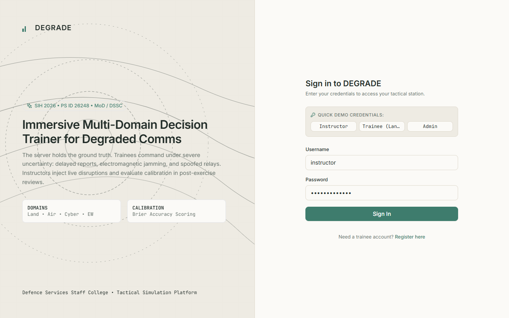
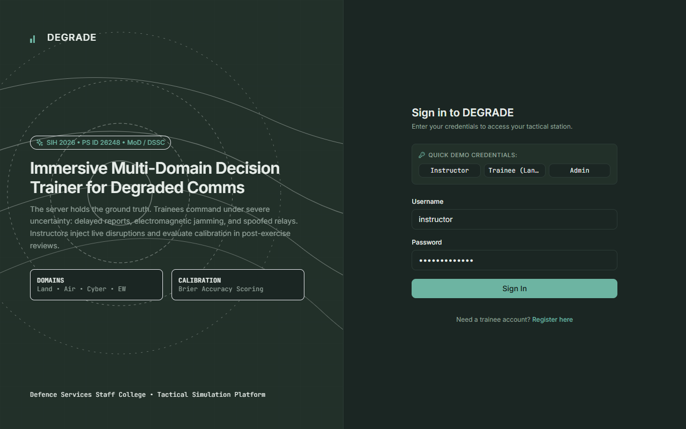
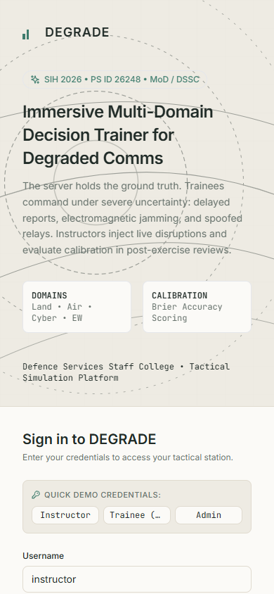
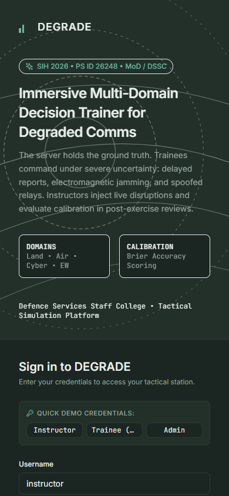
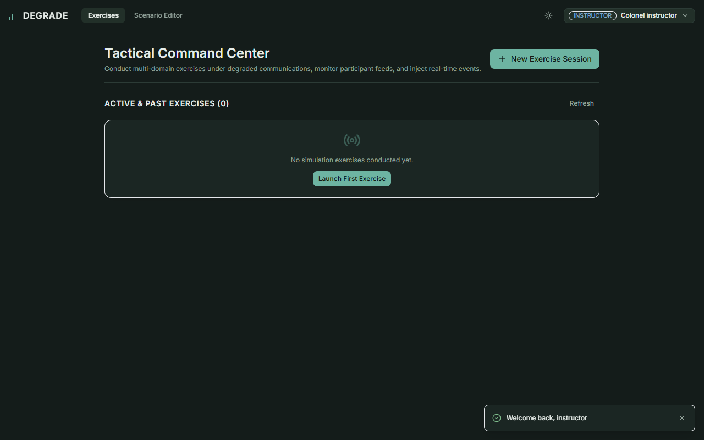
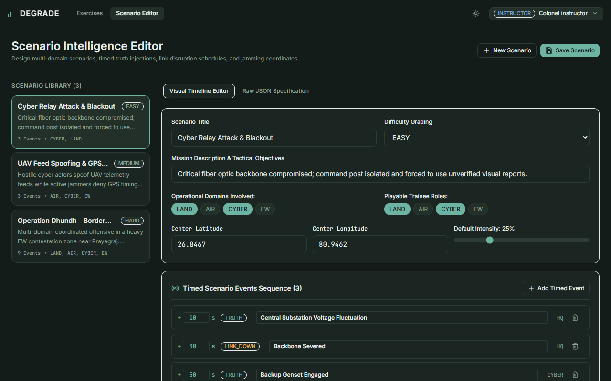

# DHUND — Decision-making Hub for Uncertain & Network-Denied Domains

[](https://www.sih.gov.in)
[](https://www.mod.gov.in)
[](https://www.djangoproject.com)
[](https://vitejs.dev)
[](https://expo.dev)

> **Ministry of Defence, Defence Services Staff College (DSSC)**  
> **Smart India Hackathon 2026 | Problem Statement ID: 26248**

---

## 🎖️ Executive Summary
In modern conflicts across Land, Air, Cyber, and Electronic Warfare (EW), electronic attacks and jamming degrade, delay, or spoof military telemetry.

**DHUND** (**D**ecision-making **H**ub for **U**ncertain & **N**etwork-**D**enied Domains) is an immersive tactical simulation system where the server maintains absolute **Ground Truth**, while every trainee commander perceives degraded telemetry (delays, dropouts, corrupted coordinates, and contradictory relays). Instructors inject live disruptions and evaluate decision calibration (Brier score) during comprehensive After-Action Reviews (AAR).

Commanders train under high stress and uncertainty, learn to cross-examine conflicting intelligence, and calibrate their confidence. Instructors command real-time exercise controls, inject disruptions live, and conduct comprehensive After-Action Reviews (AAR) contrasting **"What Was True" vs. "What You Saw"**.

---

## 🖼️ User Interface Showcase

| Desktop Sign In (Light Theme) | Desktop Sign In (Dark Theme) |
| :---: | :---: |
|  |  |

| Mobile Commander Station (Light) | Mobile Commander Station (Dark) |
| :---: | :---: |
|  |  |

| Instructor Dashboard | Scenario Intelligence Editor |
| :---: | :---: |
|  |  |

---

## 🏛️ Monorepo Architecture

```
DEFENCE_SIH/
├── backend/            # Django 5 + DRF + Channels + Daphne + Celery + Redis / SQLite
├── web/                # React 18 + TypeScript + Vite + Tailwind CSS + MapLibre GL
├── mobile/             # Expo + React Native + TypeScript + Live GPS Streaming
├── packages/shared/    # Typed API Client, Realtime Client, Zustand Reducers, Sand & Sage Tokens
├── docs/               # architecture.md, api.md, demo-script.md, screenshots/
├── scripts/            # dev.ps1, dev.sh, seed.sh, capture_screenshots.js
├── docker-compose.yml  # Multi-container orchestration (Postgres, Redis, Daphne, Celery)
├── .env.example
├── .gitignore
├── README.md
└── PUSHING_TO_GITHUB.md
```

---

## ⚡ Quick Start (Local Development)

### 1. Prerequisites
- Python 3.11+
- Node.js 20+ and npm 10+
- (Optional) Docker & Docker Compose

### 2. Windows 1-Click Complete Launch (Recommended)
Simply double-click `RUN_DHUND.bat` in the workspace root, or run:
```cmd
RUN_DHUND.bat
```
*What this does automatically:*
1. Detects Python 3.11.
2. Applies database migrations and loads demo seeds (`seed_demo`).
3. Launches the Backend ASGI Daphne server on `http://127.0.0.1:8000`.
4. Launches the Vite Web Client on `http://localhost:5173`.
5. Automatically opens your default web browser to the sign-in page!

### 3. Windows PowerShell Alternative
```powershell
.\scripts\dev.ps1
```

### 4. Linux / macOS 1-Click Launch (Bash)
```bash
chmod +x scripts/dev.sh
./scripts/dev.sh
```

### 4. Docker Multi-Container Launch
```bash
docker compose up --build
```

---

## 🔑 Default Seeded Demo Credentials
Run `python manage.py seed_demo` to initialize:

| Role | Username | Password | Rank & Assignment |
| :--- | :--- | :--- | :--- |
| **ADMIN** | `admin` | `admin12345` | Brigadier, MoD Cyber Command |
| **INSTRUCTOR** | `instructor` | `instructor123` | Colonel, DSSC Tactical Faculty |
| **TRAINEE (LAND)** | `land1` | `trainee123` | Major, 14 Strike Corps |
| **TRAINEE (AIR)** | `air1` | `trainee123` | Squadron Leader, 45 Sqn Flying Daggers |
| **TRAINEE (CYBER)**| `cyber1` | `trainee123` | Captain, Defence Cyber Agency |

---

## 🧪 Automated Test Verification

### Backend Test Suite (Django APITestCase)
```bash
cd backend
python manage.py test
```
*Tests: Seed reproducibility, trainee confidentiality protections (never exposing origin, delay_sec, or is_corrupted), role guards, exercise lifecycle, and Brier score calibration.*

### Web Test Suite (Vitest)
```bash
npm --workspace=web run test
```

### Mobile Health Check (Expo Doctor)
```bash
cd mobile
npx expo-doctor
```

---

## 🎬 3-Minute Evaluator Demo Script
A complete minute-by-minute walkthrough is documented in [`docs/demo-script.md`](docs/demo-script.md).

---

## 📄 License
Ministry of Defence, Government of India — Smart India Hackathon 2026.
