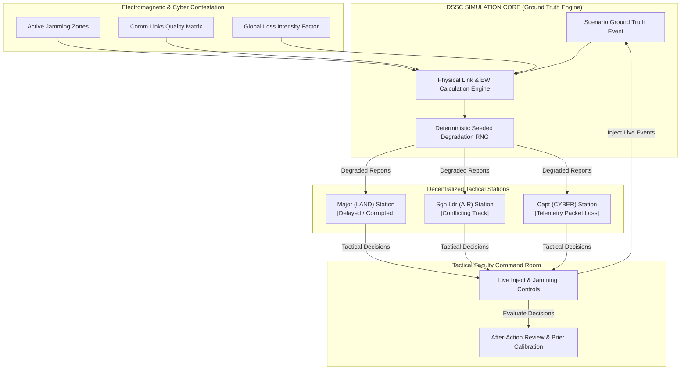

# DEGRADE — System Architecture & Multi-Domain Pipeline
**Problem Statement ID: 26248** (Smart India Hackathon 2026)  
**Ministry of Defence / Defence Services Staff College (DSSC)**

---

## 1. Architectural Philosophy: Split Truth vs Perceived Reality

In modern warfare across Land, Air, Cyber, and Electronic Warfare (EW) domains, the greatest tactical hazard is not the total absence of information, but the **deceptive distortion of information** (stale coordinates, contradictory drone dispatches, jamming packet dropouts, spoofed GPS tracks).

---

## 2. Deterministic Degradation Pipeline
Every ground truth event is filtered per participant through `plan_report(q, rng, payload, link_up)`:

1. **Effective Link Quality calculation**:
   $$q = \text{link.quality} \times (1 - 0.7 \times \text{intensity}) \times \prod_{z \in \text{zones}} (1 - z.\text{intensity})$$
2. **Packet Drop Probability**:
   $$P_{\text{drop}} = 0.8 \times (1 - q)^2$$
3. **Latency Delay Ceiling**:
   $$T_{\text{delay}} = U(0, T_{\max}) \times (1 - q)$$
4. **Coordinate Corruption (Sensor Drift)**:
   $$P_{\text{corrupt}} = 0.35 \times (1 - q)$$
   Applies spatial deviation up to $0.05^\circ \times (1 - q)$ in random directions.
5. **Conflicting Transmission Injection**:
   $$P_{\text{conflict}} = 0.25 \times (1 - q)$$
   Dispatches a contradictory second report to evaluate trainee verification instincts.

---

## 3. High-Security Confidentiality Boundary
Trainee client endpoints (`/api/exercises/{id}/feed/` and WebSocket push channels) strictly prune confidential fields:
- `origin` (NORMAL vs CONFLICT vs SPOOFED) is permanently stripped.
- `is_corrupted` is stripped.
- `delay_sec` is stripped.
- `expected_actions` and `visible_to` are stripped from payload JSON.

Only instructor and post-exercise AAR endpoints have access to the unredacted ground truth comparison.
